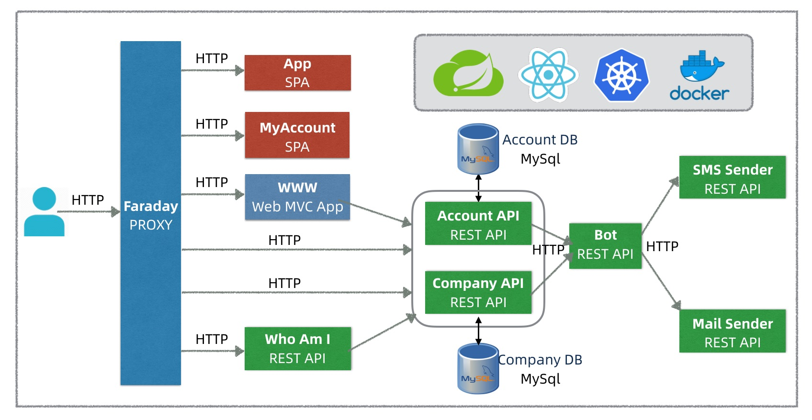

## 如何使用docker进行众多微服务的发布

step1 : 服务打包
```
mvn clean package -DskipTests
```

step2 : 镜像构建
```
docker-compose build
```

step3: 查看镜像是否存在


step4:  部署服务

`
docker-compose up
`

step5:  查看服务状态  UP代表服务已经启动成功


step6:  关闭服务

`
docker-compose down
`


## 项目架构



* **Account API(账户服务)**，提供账户注册、登录认证和账户信息管理等基本功能。
* **Company API(公司服务)**，支持团队(Team)，雇员(Worker)，任务(Job）和班次(Shift)等核心领域概念的管理功能。
* **Bot API**，是一个消息转发服务，它一方面作为队列可以缓冲高峰期的大量通知消息，另一方面作为代理可以屏蔽将来可能的通知方式的变更。
* **Mail Sender和SMS Sender**，都是消息通知服务，分别支持邮件和短信通知方式，它们可以对接各种云服务，比如阿里云邮件或短信服务。
* **WhoAmI API**，支持前端应用获取当前登录用户的详情信息，包括公司和管理员身份，团队信息等，它也可以看作是一个用户会话(Session)信息服务。
* **App(也称MyCompany)**，单页SPA应用，是整个Staffjoy应用的主界面，公司管理员通过它管理公司、雇员、任务和排班等信息。
* **MyAccount** ，单页SPA应用，它主要支持公司雇员管理个人信息，包括邮件和电话等，方便接收排班通知消息。
* **WWW应用**， 是一个前端MVC应用，它主要支持产品营销、公司介绍和用户注册登录/登出，这个应用也称为营销站点(Marketing Site)或者登录页(Landing Page)应用。
* **Faraday(法拉弟)**，是一个反向代理(功能类似nginx)，也可以看作是一个网关(功能类似zuul)，它是用户访问Staffjoy微服务应用的流量入口，它既实现对前端应用和后端API的路由访问，也实现登录鉴权和访问控制等安全功能。Faraday代理是Staffjoy微服务架构和前后分离架构的关键，并且它是唯一具有公网IP的服务。


## Staffjoy的项目
（1）[开源](https://github.com/Staffjoy)
（1）小企业提供工时排班(Scheduling)软件解决方案，帮助企业提升雇员管理效率，主要面向零售、餐饮等服务行业。
（1）帮助小企业管理者管理雇员和排班，并以短信或者邮件等方式，将排班信息及时通知到雇员

## Staffjoy应用的功能需求

具体讲，Staffjoy主要支持两类用户角色和用例，一类是公司管理员(admin)，他们可以通过Staffjoy管理公司(company)、员工目录(directory)，团队(team)和雇员(worker)，也可以创建任务(job)，创建和发布班次(shift)信息；另一类是公司雇员，他们可以通过Staffjoy管理电话和邮件等个人信息，便于接收到对应的排班通知。Staffjoy应用主要以共享版SaaS服务形式提供，也支持针对一些大客户的定制私有部署，这就要求Staffjoy应用易于部署和运维，要支持一键部署到GKE等容器云环境。另外，作为一款SaaS服务产品，良好的市场营销(Marketing)和客服是赢得用户的关键，所以Staffjoy需要提供营销友好的(Marketing Friendly)宣传和登录页(Landing Page)，也要支持对接主流的在线客服系统如Intercom。


